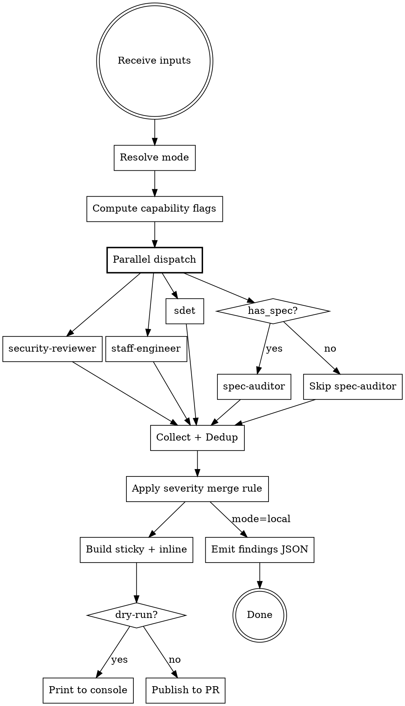
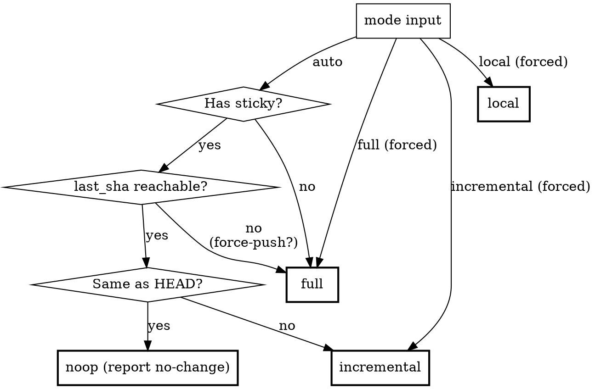
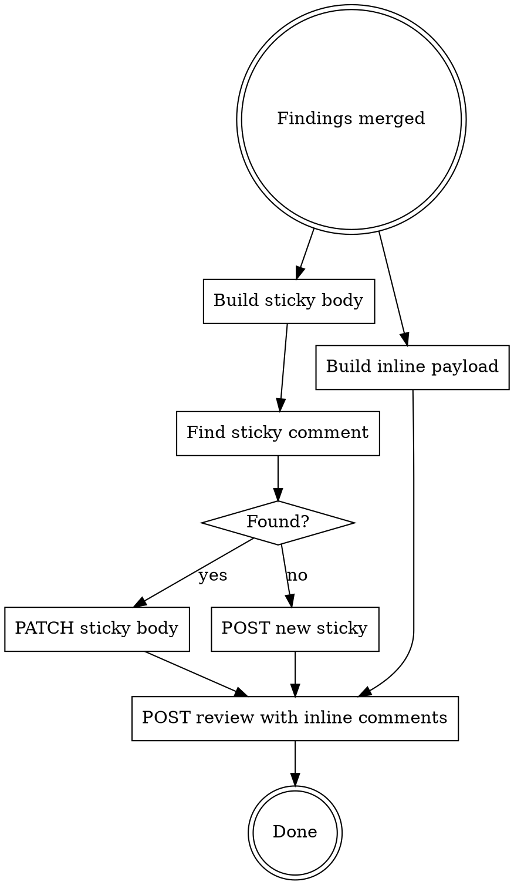

# PR Review

Review a PR/MR diff by dispatching independent role-based subagents in parallel, then publish findings as one sticky summary comment + per-finding inline comments. The main session never reviews — it ingests, dispatches, merges, emits, publishes.

<HARD-GATE>
You MUST dispatch independent subagents — NEVER review the diff yourself in the main session. The main session accumulates context bias from prior conversation. Only an isolated subagent can deliver an unbiased finding.

Dispatch in PARALLEL using a single message with multiple Agent tool calls. If one subagent fails, proceed with the rest BUT surface the failure in the sticky comment header (never silent). If ALL fail, report failure — do NOT fall back to self-review.

Publishing happens in the main session (post-merge) — not in subagents.

`mode: local` does NOT relax this gate. Local mode changes the output target (JSON to stdout instead of GitHub sticky/inline), not the reviewer. The 4-subagent parallel dispatch is exactly the property that makes local mode worth invoking from a supervisor session — without it the caller could just self-review.
</HARD-GATE>

## Rationalization Prevention

| Thought                                        | Reality                                                                                               |
| ---------------------------------------------- | ----------------------------------------------------------------------------------------------------- |
| "The diff is small, I can review it myself"    | Self-review is biased by what you saw in the conversation. Small ≠ unbiased.                          |
| "I already saw this code earlier"              | That's exactly why you can't review it. Familiarity hides issues.                                     |
| "Dispatching 3-4 subagents is overkill"        | Each persona uses a different mental model. A single agent dilutes all of them.                       |
| "Sequential is fine, I'll save tokens"         | Parallel is faster wall-clock and prevents one report from biasing the next.                          |
| "spec-auditor isn't needed, the spec is short" | If has_spec is true, dispatch. The check is whether spec exists, not whether it's verbose.            |
| "I'll just check the obvious bug myself"       | Even one self-checked finding contaminates the report — readers can't tell which findings are biased. |
| "1 subagent failed, just hide it"              | Hiding partial review = pretending coverage existed. Surface it in sticky header.                     |
| "Prior finding line moved, mark fixed"         | Line moving ≠ behaviour fixed. Require subagent verification, then hedge as `Likely fixed`.           |

## Red Flags — STOP if you catch yourself:

- Reviewing any category yourself instead of dispatching
- Dispatching subagents sequentially instead of in parallel
- Skipping a subagent because "the diff doesn't look like it has X"
- Claiming review passed without reading subagent findings
- Editing code during review (review reads, doesn't write)
- Falling back to self-review because a subagent failed
- Hiding subagent failures in output (must surface in sticky header)
- Marking prior findings as `✅ Fixed` without a verification note from subagent
- Publishing inline comments before merging findings (dispatch → merge → publish)

<decision_boundary>

**Use for:**

- Reviewing a PR/MR diff and producing structured findings
- Security / logic / performance scans on code changes
- Spec compliance verification when spec exists
- Organizing findings with severity + blast radius + confidence
- Posting findings to GitHub PR as sticky summary + inline comments

**NOT for:**

- Writing or improving PR descriptions
- Design review requiring business judgment about scope or direction
- Writing the actual code/diff
- Deep CVE / supply-chain / OWASP sweep
- Writing release notes / CHANGELOG
- End-user / UX review (use /qa or /design-review)
- Auto-approving or auto-merging (produce findings only; humans merge)

</decision_boundary>

## Flow



## Inputs

### Required

**`pr`** — `<owner>/<repo>#<N>` or full PR URL. Used for sticky lookup and publishing. No implicit branch-based detection (too brittle).

> **Exception**: `mode: local` does not require `pr` (no GitHub side effects). See [Local Mode](#local-mode).

### Optional

**`mode`** — `auto` (default) / `full` / `incremental` / `local`. See [Mode Detection](#mode-detection) and [Local Mode](#local-mode).

**`dry-run`** — `true` / `false` (default `false`). When true, builds sticky + inline payloads and prints to console; no GitHub API writes.

**`base`** — base git ref for diff scope (e.g. `origin/main`). Used by **local mode only** — replaces the sticky/PR-based base lookup. Ignored for other modes (they derive base from the PR or repo state).

**`last_sha`** — prior reviewed HEAD commit. Used by **local mode only** for incremental review. In non-local modes the last_sha lives in the sticky body; local mode has no sticky, so the caller (e.g. supervisor) must pass it explicitly.

**`spec`** — source of the spec / design doc. Sets `has_spec` flag.

- Path: `spec: docs/specs/payment-v2.md`
- URL: `spec: https://confluence.example.com/payment-v2`
- Inline: `spec: this PR implements PCI DSS v4.0 logical isolation`
- Multiple: `spec: design doc at X, acceptance criteria in Jira ABC-123`

If absent → spec-auditor not dispatched. Other subagents do not reference spec.

**`test direction`** — tells sdet how to evaluate test coverage. All sub-fields optional:

- **Approach**: `unit only` / `integration required` / `e2e required` / `no test needed`
- **Location**: expected test file path
- **Focus**: scenario or case the test should cover

Missing → sdet uses heuristic from diff nature.

**`context`** — free-form supplementary signals:

- **Business risk**: "this endpoint is internal-admin only"
- **Domain rules**: "tenant_id is required"
- **Known trade-offs**: "we're aware of the N+1, will fix next sprint"
- **Environment constraints**: "CDE service, security findings cannot be downgraded"
- **Hotfix narrowing**: "hotfix — only check critical security"
- **Cross-PR coupling**: "ships together with PR #1234"

Context can adjust severity at merge time (see Severity Merge Rule).

## Mode Detection

Resolve before dispatch. The mode controls diff scope and output sections.

`mode: local` short-circuits this whole section — no sticky lookup, no SHA reachability check, no noop case. Diff scope comes from the `base` (and optional `last_sha`) inputs; see [Local Mode](#local-mode).



Sticky discovery:

```bash
gh api repos/<owner>/<repo>/issues/<N>/comments \
  --jq '.[] | select(.body | contains("<!-- pr-review:sticky -->")) | {id, body}'
```

Markers embedded in sticky body:

- `<!-- pr-review:sticky -->` — locator
- `<!-- pr-review:sha=<commit> -->` — last reviewed HEAD

SHA reachability:

```bash
git cat-file -e <last_sha> 2>/dev/null && echo reachable || echo unreachable
```

If unreachable (force-push / squash-merge of older PR / branch rebased): fall back to `full` AND prepend to sticky body:

```markdown
> ⚠️ Prior review base `<last_sha>` is not reachable (force-push?). This iteration is a full re-review.
```

### Noop case (`last_sha == HEAD`)

When the sticky exists AND `last_sha == HEAD`: skip dispatch + publish. Print to console:

> `pr-review: nothing new since <last_sha>. Skipping. Use mode=full to force a re-review.`

The sticky is already current; do not touch it.

## Local Mode

Use when the caller is **another skill or supervisor session** that needs unbiased multi-role review of a diff but has **no PR open yet** (e.g. a supervisor session's verify phase doing pre-PR critique). The HARD-GATE still applies — local mode is about output target, not about who reviews.

> **Caveat — calling from the same dev session that wrote the code (author-as-reviewer bias)**: pr-review's 4-subagent dispatch is isolated by design — finding generation is robust even when called from the author's session. **But the downstream `modify / wontfix / defer` verdict on each finding is NOT covered by this isolation.** If the same session that wrote the code also reasons about which findings to wontfix, author-narrative bias compounds — framing a diff as "bug-free" produces the strongest detection drop among framing conditions tested across 6 LLMs (Mitropoulos et al., *Measuring and Exploiting Contextual Bias in LLM-Assisted Security Code Review*, [arXiv:2603.18740](https://arxiv.org/abs/2603.18740)). Treat local-mode findings as **advisory** in dev sessions; do **NOT auto-execute verdicts in main session**. A proper dev-stage verdict loop needs a separate Deriver-pattern verdict-subagent (not built yet — see `pr-babysit/SKILL.md` § 4.6 "When NOT to use" for the equivalent caveat on Wontfix Template).

### Inputs

- `mode: local` (required to enter this mode)
- `base: <ref>` (required — e.g. `origin/main`)
- `last_sha: <sha>` (optional — if provided, runs incremental on `<last_sha>..HEAD` and still reads `<base>...HEAD` for cumulative context that subagents need for prior-finding verification)
- `spec`, `test direction`, `context` — same semantics as default mode

`pr` is NOT required and ignored if provided.

### Diff scope

- No `last_sha` → full diff: `git diff <base>...HEAD` (three-dot — topic-only changes)
- With `last_sha` → incremental: subagents see both `<base>...HEAD` and `<last_sha>..HEAD`; they report findings only inside the incremental window plus verification status for prior findings (caller must pass prior findings too — see below)

### Caller responsibilities (incremental local mode)

The sticky normally carries prior findings between iterations. In local mode the caller owns that state and must pass to pr-review on each invocation:

- `prior_findings`: array of objects with `{id, slug, file, line, category, severity, justification, summary}` — same shape as findings JSON output (see below)
- `prior_fix_range`: `<first-fix-sha>^..<last-fix-sha>` — the commits that addressed iter (N-1) findings, used by the threshold's drop signal (B)

If `last_sha` is set but `prior_findings` is missing → ESCALATE to caller; do not fabricate.

### Output

Skip Publishing. Skip sticky/inline markdown construction. Emit one JSON document to stdout:

```json
{
  "mode": "local",
  "base": "origin/main",
  "head": "<HEAD sha>",
  "last_sha": "<sha or null>",
  "status": "blocking | review-before-merge | approved-with-notes | approved | noop | partial-failure",
  "subagent_failures": [],
  "summary_line": "<same wording as sticky summary line>",
  "findings": [
    {
      "id": "#1",
      "p_code": "P0 | P1 | P2 | Q",
      "severity_emoji": "🚨 | ⚠️ | 💡 | ❓",
      "slug": "kebab-case-slug",
      "category": "Original [code name] from subagent",
      "file": "path/to/file",
      "line_start": 42,
      "line_end": 42,
      "confidence": "high | medium | low",
      "blast": "Local | Module | Cross-service | Data layer",
      "justification": "Reachable | Precedent | Asymmetric | Historical",
      "failure_mode": "one-line",
      "mitigation": "one-line",
      "evidence": "verbatim diff line(s)",
      "details": "optional multi-line",
      "severity_adjustment": null | { "from": "💡 P2", "to": "⚠️ P1", "reason": "..." }
    }
  ],
  "spec_gaps": [
    {
      "id": "#7",
      "section": "spec section or decision id",
      "title": "one-line",
      "spec_quote": "verbatim",
      "code_quote": "verbatim",
      "questions": ["..."]
    }
  ],
  "prior_verifications": [
    {
      "prior_id": "#1",
      "verification": "yes | unclear | no",
      "note": "what evidence"
    }
  ],
  "checked_and_clean": [
    { "slug": "...", "evidence": "one-line" }
  ]
}
```

`severity_adjustment: null` when no adjustment; the merged severity is already reflected in `p_code` / `severity_emoji`. The adjustment field exists so callers can audit downgrades (same role as the sticky's `## ⚖️ Severity adjustments` section).

`prior_verifications` is empty `[]` when `last_sha` is absent.

### What local mode keeps from default mode

- HARD-GATE: still dispatch 4 parallel subagents; main session never reviews
- Capability flags (has_spec, has_repo, is_trivial)
- Finding Inclusion Threshold (Reachable / Precedent / Asymmetric / Historical + drop signals A/B/C/D)
- Severity Merge Rule (4 steps + P-code mapping)
- Dedup between subagent findings
- Subagent failure → if all 4 fail, report failure to caller; never self-review

### What local mode drops

- Sticky comment build / markdown rendering
- Inline comment markdown / GitHub Review API call
- Sticky discovery via `gh api`
- last_sha derivation from sticky body (caller passes it)
- Noop case (caller decides whether to re-invoke; if `last_sha == HEAD` and caller still invokes, return `findings: []` + a `status: "noop"`)

## Capability Flags

Compute before dispatch:

| Flag         | Default | Set when                                                          | Effect                   |
| ------------ | ------- | ----------------------------------------------------------------- | ------------------------ |
| `has_spec`   | false   | spec input present OR PR description has goal/requirement section | dispatch spec-auditor    |
| `has_repo`   | true    | repo access available (grep / index / LSP)                        | enable cross-file checks |
| `is_trivial` | false   | <50 LOC AND (docs-only OR pure rename OR pure type-only)          | skip staff-engineer      |

## Dispatch

Default dispatch (4 subagents in parallel via a single message):

| Subagent          | Prompt file                   | When dispatched             |
| ----------------- | ----------------------------- | --------------------------- |
| security-reviewer | `security-reviewer-prompt.md` | always                      |
| staff-engineer    | `staff-engineer-prompt.md`    | always (skip if is_trivial) |
| sdet              | `sdet-prompt.md`              | always                      |
| spec-auditor      | `spec-auditor-prompt.md`      | only if has_spec            |

Each subagent receives:

- Diff (full in `full` mode; `<last_sha>..HEAD` in `incremental` mode)
- Capability flags (has_spec, has_repo, is_trivial)
- Mode (`full` / `incremental`)
- Their relevant inputs only (spec content for spec-auditor, test direction for sdet)
- In `incremental` mode (dispatcher MUST provide all three):
  - Prior findings JSON (subagent's own category scope only)
  - Prior `Checked & clean` slugs for drift spot-check
  - **`prior_fix_range`**: `<first-fix-sha>^..<last-fix-sha>` — git range covering the commits that addressed iter (N-1) findings. Subagent uses this to apply drop signal (B) self-introduced surface. In single-commit-per-iter cases this collapses to `<last_sha>..HEAD`. If the dispatcher cannot determine the range (e.g. force-push, squash-merge of iter N-1 commits) → fall back to `full` mode and announce in sticky; do NOT invoke incremental mode without `prior_fix_range`
- NO conversation history, NO session context, NO prior subagent findings from this run

**Threshold inlining**: the [Finding Inclusion Threshold](#finding-inclusion-threshold) is inlined directly in each subagent prompt (`security-reviewer-prompt.md` / `staff-engineer-prompt.md` / `sdet-prompt.md` / `spec-auditor-prompt.md`). Dispatcher does NOT need to prepend threshold text — subagents apply it from their baked-in section. This avoids relying on dispatcher's "good behavior" to inject the gate on every invocation.

### Incremental-mode subagent additions

In incremental mode, each subagent ALSO emits for every prior finding within its scope:

```
Prior finding status: <id>
verification: yes | unclear | no
note: <one-line — what evidence supports the verification>
```

Mapping to display status (in `## 🔄 Changes since last review` table):

| `verification` | Display                                                                 |
| -------------- | ----------------------------------------------------------------------- |
| `yes`          | ✅ Likely fixed `<sha>` — <verification note>                           |
| `unclear`      | ⏸️ Untouched — <note: "file segment not in diff">                       |
| `no`           | 🔄 Still present — <note: "evidence still observable at <file>:<line>"> |

**Never** emit `✅ Fixed` without `verification: yes`. Default hedge is `Likely fixed` always — finality belongs to the human reviewer.

### Fallback rules

- 1 subagent fails → continue with rest; sticky header shows `⚠️ Partial — <subagent> failed`
- 2+ fail → continue with surviving findings; sticky header shows `⚠️ Partial — N/4 subagents failed: <names>`
- ALL fail → report failure to user, do not publish, never self-review

## Subagent Finding Contract

Each subagent emits findings in this shape:

```
[<category-id> <category-name>] <file>:<line_start>-<line_end>
Severity: 🚨 | ⚠️ | 💡 | ❓
Confidence: high | medium | low
Blast: Local | Module | Cross-service | Data layer
Justification: Reachable | Precedent | Asymmetric | Historical

Evidence: <verbatim diff line(s) — cite-or-drop rule>
Failure mode: <one-line — what breaks if shipped as-is>
Mitigation: <one-line — fix action; cite test path when test coverage is part of the fix>
Details: <optional — multi-line narrative, repro steps, code patch. Use only when Failure mode genuinely needs more than one line>
Notes: <optional — only if severity differs from default>
```

**Field semantics**:

- `Failure mode` — concrete bug / breach / drift consequence. Forces severity calibration: if you cannot describe what goes wrong in one line, you do not have a finding.
- `Mitigation` — actionable fix. When the finding's resolution involves test coverage, name the test file and case (e.g. `add assert in foo_test.py:42 'rejects empty input' case`).
- `Details` — escape hatch for findings whose explanation cannot fit one line (e.g. multi-step race, cross-file impact chain). Keep `Failure mode` and `Mitigation` as one-liners regardless; put narrative here.
- `Justification` — required class declaring why the finding is worth emitting. See [Finding Inclusion Threshold](#finding-inclusion-threshold) below. Findings that cannot commit to one of the four classes MUST NOT be emitted as standalone findings; batch into a Q-class hygiene followup instead.

After findings, each subagent emits `N/A categories: [<list>]` declaring which of its owned categories were reviewed and clean. This distinguishes "checked, found nothing" from "skipped".

spec-auditor uses `Spec quote:` + `Code quote:` instead of single `Evidence:` — both must be verbatim quotes. `Failure mode` for spec findings = "what spec contract gets violated if shipped".

**Drop rule**: any finding without `Evidence:` (or both quotes for spec-auditor) is fabrication — discard before merge.

## Finding Inclusion Threshold

This gate is applied by each subagent inline before emitting a finding. **Canonical definition lives in the subagent prompts, not here** — see any of:

- `security-reviewer-prompt.md` § Finding Inclusion Threshold
- `staff-engineer-prompt.md` § Finding Inclusion Threshold
- `sdet-prompt.md` § Finding Inclusion Threshold
- `spec-auditor-prompt.md` § Finding Inclusion Threshold

All four contain the same Justification classes (Reachable / Precedent / Asymmetric / Historical), the same drop signals (A / B / C / D), and the same Asymmetric escape hatch. Per-prompt variations only add category-specific guidance (e.g. "most S1–S5 are Asymmetric" for security, "rare for T-class" for SDET).

**Why duplicated across four prompts rather than referenced from one source**: see [Design note: prompt inlining](#design-note-prompt-inlining-over-reference-indirection).

**Full vs incremental mode**: full mode applies the threshold but drop signal (B) self-introduced surface never fires (no `prior_fix_range` on iter 1). Incremental mode applies all four signals.

**Spec ambiguity rule** (applies only to spec-auditor's C-class findings, kept in this SKILL.md as cross-cutting): if a candidate finding's mitigation offers "add a code comment" / "document the limitation in a comment" as an **equal-weight** resolution (phrasing "either X or document Y"), the finding is a Q-class spec gap addressed to the spec author, not P-class actionable. A comment-as-last-resort **fallback** ("do X; if impractical, document Y") keeps the finding actionable — the primary mitigation is what gets judged.

## Severity Merge Rule (deterministic precedence)

Apply in fixed order to each finding. Lower number wins on conflict.

1. **Base severity** — assigned by subagent at finding emission (emoji form)
2. **Confidence demote** — `confidence: low` → demote to ❓ Question (terminal, no further escalation)
3. **Blast escalate** — `blast: cross-service` or `blast: data-layer` → escalate one level (max 🚨 Blocker). Skipped if step 2 already demoted.
4. **Context adjust** — overrides from context input (e.g. "CDE service: security cannot downgrade") applied last
5. **Final severity** — result after all four steps
6. **Map to P-code** for output (dispatcher does this; subagents emit emoji severity only):

| Emoji         | P-code | Label                        |
| ------------- | ------ | ---------------------------- |
| 🚨 Blocker    | **P0** | must fix; blocks merge       |
| ⚠️ Factual    | **P1** | should fix                   |
| 💡 Suggestion | **P2** | consider                     |
| ❓ Question   | **Q**  | clarify; not a priority tier |

Severity ordering (for sort): P0 > P1 > P2. Q is orthogonal.

Downgrades (step 4 lowering a tier) MUST appear in the `Severity adjustments` section. Never silent. Never collapsed behind `<details>` — render as plain section when any adjustment exists.

## Dedup (between subagent findings)

- Same `file:line` + same category → keep highest base severity, attribute to all reporting subagents
- Same issue described differently across subagents → merge into one finding with combined notes
- Cross-cutting (e.g. staff-eng AND sdet both flag missing test for SQL injection) → keep both, dispatcher cross-references

## Output Language

PR-published prose (sticky shape narrative, `Failure mode` / `Mitigation` / `Details` content, spec gap question body, verification notes, framing text around code refs) renders in the PR description's primary language. Everything else — markers, section titles, field labels, kebab-case slugs, P-codes, severity / justification / status tokens, the race meta tag — stays English.

Fallback when the PR description lacks substantive prose: linked issue body, then English.

Terminal / JSON output (`mode=local` JSON, dry-run console, noop message) stays English regardless of PR language — those go to callers, not the PR.

## Output Format

Two artifacts produced post-merge:

1. **Sticky comment** — single issue comment on the PR; updated in place across iterations (PATCH same comment id)
2. **Inline review comments** — one GitHub review submission (`event=COMMENT`) containing one comment per P0 / P1 / P2 finding; Q findings stay in the sticky

Status tier (drives sticky header wording, NOT the actual GitHub review event):

| Condition           | Wording                                        |
| ------------------- | ---------------------------------------------- |
| Any P0              | `🔴 Blocking issues found`                     |
| No P0, any P1       | `⚠️ Review before merge`                       |
| Only P2 / Q         | `✅ Approved with notes`                       |
| Zero findings       | `✅ Approved`                                  |
| Any subagent failed | prepend `⚠️ Partial — <details>` to the status |

The skill **does not** submit `APPROVE` or `REQUEST_CHANGES` reviews. Status wording lives inside the sticky comment only. Auto-approve / auto-merge is forbidden.

### Summary line (top of sticky)

Show only non-zero P-buckets + total + clean count. Zero suppression keeps the line scannable; incremental drift is communicated via the `Changes since last review` table, not by comparing zero counts.

```
**Review: <status>** · <total> finding(s) (<P0×N, P1×N, P2×N, Q×N — only non-zero>) · ✅ <N> clean
```

Examples:

```
**Review: ✅ Approved** · 0 findings · ✅ 11 clean
**Review: ✅ Approved with notes** · 1 finding (P2×1) · ✅ 11 clean
**Review: ⚠️ Review before merge** · 6 findings (P1×2, P2×3, Q×1) · ✅ 11 clean
**Review: 🔴 Blocking issues found** · 3 findings (P0×1, P1×2) · ✅ 11 clean
**Review: ⚠️ Partial — security-reviewer failed · ⚠️ Review before merge** · 2 findings (P1×2)
```

### Category slugs

Convert each subagent's `[<code> <name>]` to a kebab-case slug for output. Drop the subagent-owned code (S/E/T/C). Examples:

- `[E3 Conditional side effects]` → `state-consistency` (use semantic slug, not the literal name when one is more reviewer-meaningful)
- `[S3 Secret / credential]` → `secrets-handling`
- `[T1 Test coverage gaps]` → `missing-coverage`
- `[C4 Business rule alignment]` → `decision-conflict`

When semantic slug differs from the literal category name, prefer semantic. The slug is the navigation handle reviewers see; pick the term that conveys "what kind of problem" most directly.

### Sticky comment template

```markdown
<!-- pr-review:sticky -->
<!-- pr-review:sha=<HEAD> -->

> 🤖 Automated review by `pr-review` skill

**Review: <status>** · <total> finding(s) (<non-zero buckets>) · ✅ <N> clean

> <one-line shape narrative — what's the issue cluster; render in PR description language. English example: "observability + state-consistency form two P1 clusters; security clean">

## 📋 Currently open (<N>)

- **<id>** <P-code> `<slug>` — <file>:<line>
- ...

📍 **Inline comments**: <N> findings pinned to source lines (see the Files changed tab) — render this locator line in PR description language

## ⚖️ Severity adjustments

<rendered only when ≥1 adjustment exists; NOT inside <details>; see template below>

## 🔄 Last iteration changes (`<last_sha>..<HEAD>`)

<rendered only in incremental mode; ONLY this iter's verifications, not cumulative; see template below>

<details><summary>📊 Overview by category</summary>

| Category |  P0 |  P1 |  P2 |   Q | Files                         |
| -------- | --: | --: | --: | --: | ----------------------------- |
| `<slug>` |   N |   N |   N |   N | <file paths, comma-separated> |

</details>

<details><summary>❓ Spec gap questions (<N>)</summary>

<rendered only when spec-auditor emitted gap items>

</details>

<details><summary>✅ Checked & clean (<N>)</summary>

- `<slug>`: <one-line evidence — what specific patterns were verified clean, or which grep / file-read confirmed>
- ...

</details>

---

🤖 `pr-review` skill · reviewed `<base>..<HEAD>`<· last reviewed `<last_sha>` — incremental only>
```

Rules:

- Shape narrative mandatory when ≥2 findings; optional for 0-1
- `📋 Currently open` rendered **flat** (no `<details>`) when ≥1 finding is not yet `Likely fixed`; one bullet per finding, sorted P0→P1→P2→Q then by file path. Omit the section entirely when all findings are closed (avoid empty heading)
- `📊 Overview by category` always in `<details>` (collapsed); rows omitted where P0/P1/P2/Q are all zero. Collapsed by default — summary line already conveys totals; the table is for drill-down only
- `📍 Inline comments` line shown when ≥1 P0/P1/P2 finding posted inline; omit otherwise
- `Severity adjustments` rendered **flat** (no `<details>`) when any adjustment exists — discipline requirement, never silent
- `🔄 Last iteration changes` rendered **flat** in incremental mode; shows ONLY this iter's verifications (`<last_sha>..<HEAD>`), never cumulative across older iterations. Audit trail for older iters lives in git history (commits + prior inline comment threads), not in the sticky
- `Spec gap questions` always in `<details>` (collapsed) — verbose; secondary to actionable findings
- `Checked & clean` always in `<details>` (collapsed) — count is the load-bearing signal; expand for trust calibration

### Severity adjustments section

```markdown
## ⚖️ Severity adjustments

| #    | Category | Adjustment                                         | Reason              |
| ---- | -------- | -------------------------------------------------- | ------------------- |
| #<n> | `<slug>` | <original-emoji + P-code> → <final-emoji + P-code> | <reason — one line> |
```

### Last iteration changes section (incremental only)

```markdown
## 🔄 Last iteration changes (`<last_sha>..<HEAD>`)

| Prior                                | Status                                        |
| ------------------------------------ | --------------------------------------------- |
| #<n> <P-code> <slug> (<file>:<line>) | ✅ Likely fixed `<sha>` — <verification note> |
| #<n> <P-code> <slug> (<file>:<line>) | 🔄 Still present — <note>                     |
| #<n> <P-code> <slug> (<file>:<line>) | ⏸️ Untouched — <note>                         |
| #<n> Q <slug>                        | ⏸️ Awaiting spec author                       |
```

Scope: **only findings whose status changed (or was re-confirmed) in this iteration's `<last_sha>..<HEAD>` diff**. Untouched findings carrying over from before `<last_sha>` belong in `📋 Currently open`, not here. The table is the delta, not the inventory.

Status legend (hedged on purpose — line-moved ≠ behaviour-fixed):

- `✅ Likely fixed <sha>` — subagent emitted `verification: yes` + note explaining what changed
- `🔄 Still present` — subagent emitted `verification: no` + note pointing to remaining evidence
- `⏸️ Untouched` — subagent emitted `verification: unclear` (file segment not in diff)

### Inline comment body template

One per P0 / P1 / P2 finding. Posted via GitHub Review API (single review, `event=COMMENT`).

````markdown
** <slug>**

**Failure mode**: <one-line>

**Mitigation**: <one-line; cite test path when applicable>

<details><summary>Evidence</summary>

```diff
<verbatim diff line(s)>
```

</details>

<sub>blast: <Local|Module|Cross-service|Data layer> · <reversible|not reversible> · confidence: <high|medium|low> · justification: <Reachable|Precedent|Asymmetric|Historical></sub>

<!-- pr-review:finding-id=#<n> -->
<!-- pr-review:justification=<Reachable|Precedent|Asymmetric|Historical|Hygiene> -->
````

The `justification` HTML marker is consumed by `pr-babysit`'s diminishing-returns gate to decide whether to keep looping or hand back to the user. `Hygiene` value is reserved for batched Q-class hygiene followups; never emit `Hygiene` on a P0/P1/P2 finding.

Badge colors:

- `P0` → `red`
- `P1` → `orange`
- `P2` → `yellow`

`reversible` derivation:

- `reversible` — code-only change, additive feature, refactor without state migration
- `not reversible` — destructive migration, breaking contract change, irreversible side effect (sent message, deleted data)
- omit if ambiguous (don't guess)

### Spec gap questions (in sticky `<details>`)

```markdown
### ❓ #<n> <spec-section-or-decision-id> — <one-line title>

`<Blast>` · spec-author confirm

**Spec quote**: <verbatim>

**Code quote**: <verbatim>

**Question for spec author**:

1. <numbered question>
2. ...

<closing line, in PR description language — e.g. "not blocking the PR; want to clarify X">
```

Q findings do **not** become inline comments — they're often cross-file conceptual questions, pinning to a line misleads.

### What to drop from output

| Drop                                                 | Why                                                                           |
| ---------------------------------------------------- | ----------------------------------------------------------------------------- |
| `Capability: has_spec=Y · has_repo=Y · is_trivial=N` | dispatch logic; reviewer doesn't care                                         |
| `Subagents: security ✅ · staff-eng ✅ · ...`        | which bots ran is process metadata — UNLESS one failed (then surface)         |
| `Source: <subagent>` per finding                     | reviewer wants "what kind of issue" (already in category), not "who found it" |
| `<subagent>/` namespace prefix on slugs              | leaks subagent identity; bare slug reads cleaner                              |
| `Checked & clean` grouped under subagent headers     | same — flat topic list                                                        |
| Empty `Severity adjustments` section heading         | render section only when content exists                                       |

## Publishing

Runs after merge step. Skipped entirely when `dry-run: true` (print sticky + inline payloads to console instead) **or** when `mode: local` (emit findings JSON to stdout — see [Local Mode](#local-mode)).



### Commands

```bash
# 1. find sticky id (may be empty)
STICKY_ID=$(gh api repos/$OWNER/$REPO/issues/$N/comments \
  --jq '.[] | select(.body | contains("<!-- pr-review:sticky -->")) | .id' | head -1)

# 2. write sticky body to a temp file (skill builds the markdown)
# sticky.md should embed both markers: <!-- pr-review:sticky --> and <!-- pr-review:sha=$HEAD -->

# 3a. create new sticky
[ -z "$STICKY_ID" ] && gh api -X POST repos/$OWNER/$REPO/issues/$N/comments \
  -F body=@sticky.md

# 3b. or patch existing sticky
[ -n "$STICKY_ID" ] && gh api -X PATCH repos/$OWNER/$REPO/issues/comments/$STICKY_ID \
  -F body=@sticky.md

# 4. post inline comments as one review (single API call)
# inline-comments.json shape: [{"path": "...", "line": N, "side": "RIGHT", "body": "..."}, ...]
gh api -X POST repos/$OWNER/$REPO/pulls/$N/reviews \
  -F event=COMMENT \
  -F body="See sticky summary above." \
  -F 'comments=@inline-comments.json'
```

### Old inline comments

Do **not** delete or resolve old inline review comments from prior iterations. GitHub auto-marks them `outdated` when the underlying line moves; the UI collapses outdated threads. This is the chosen trade-off (vs. graphql resolve) for operational simplicity.

### Dry-run mode

When `dry-run: true`:

- Print sticky body markdown to console (with markers)
- Print inline payload as JSON
- Skip all `gh api` writes
- Useful for first-time use, debugging, or auditing output before publishing

## Design note: prompt inlining over reference indirection

Subagents (security-reviewer / staff-engineer / sdet / spec-auditor) operate as isolated `Agent` dispatches with no shared loader. They cannot follow a "see `references/X.md`" pointer at dispatch time — references load via the main session, not the subagent's. This inverts skill-creator's default duplication-avoidance principle: any policy a subagent MUST apply is **inlined verbatim into each subagent prompt**, not stored once in `references/` and pointed to.

Current inlined-duplicated content (intentional, not drift):

- **Finding Inclusion Threshold** (Justification classes + drop signals A/B/C/D) — identical wording across all 4 subagent prompts; SKILL.md only points to them
- **Race-class Finding Metadata** (`[window=..., damage=..., recovery=...]` meta tag spec) — identical across `staff-engineer-prompt.md` + `security-reviewer-prompt.md`; pr-babysit's Gate B parser depends on identical syntax

Cross-prompt sync is maintained via `<!-- keep-in-sync: ... -->` HTML comments at each duplicated section header. When editing one, grep for the keep-in-sync marker to find paired sections.

**Do NOT** refactor inlined content into a shared `references/` file — the alternative regresses to the exact failure mode that motivated inlining. SKILL.md previously claimed "dispatcher prepends threshold at dispatch time" and that contract was never enforced (commit `328b73b8` fixed it by baking threshold into prompts; ⇒ this design note exists to prevent a future editor from re-introducing the same gap).

## Notes

- **Don't auto-approve or auto-merge** — produce findings; merge belongs to humans
- **Lean conservative** — low-confidence findings always demote to ❓ Question (Q)
- **Spec gaps don't block review** — mark Q for spec author, proceed with code findings
- **Severity downgrades must be visible** — flat section in sticky, never `<details>`
- **Don't auto-grep for spec location** — use only what the user provides
- **Subagent reports are advisory** — dispatcher applies merge rule and dedup, not subagents
- **Subagent failure must be surfaced** — sticky header carries the partial-mode warning; never silent
- **Prior findings: hedge on "fixed"** — always `Likely fixed`, never bare `Fixed`; line-moved ≠ behaviour-fixed
- **Force-push aware** — when last_sha is unreachable, fall back to full + announce in sticky
- **Output language is adaptive** — PR-published prose follows the PR description's language; markers / titles / field labels / keywords / terms stay English. See [Output Language](#output-language)
- **Local mode is JSON-only** — no markdown, no sticky, no inline; caller (e.g. a supervisor session) consumes findings JSON and drives its own follow-up loop
